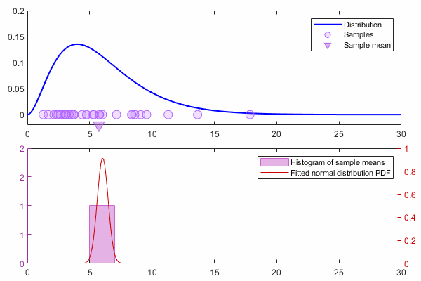
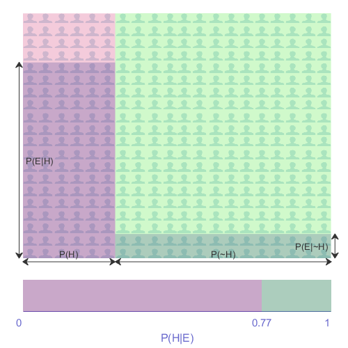
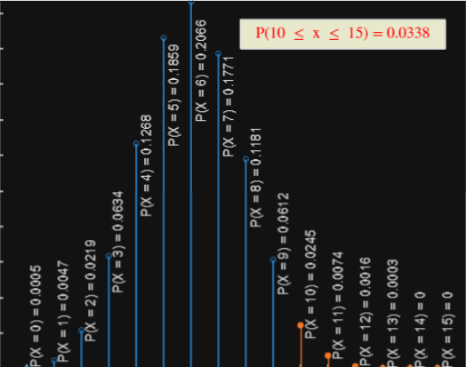

# Fundamentals of Probability Theory

 or 

**Curriculum Module**

_Created with R2024a. Compatible with R2024a and later releases._

# Information

This curriculum module contains interactive [MATLAB® live scripts](https://www.mathworks.com/products/matlab/live-editor.html) and supporting files that teach fundamental concepts in probability theory and statistical inference.

## Background

You can use these live scripts as demonstrations in lectures, class activities, or interactive assignments outside class. This module covers subjective, empirical, classical, and conditional probability, Bayes' theorem, concepts of discrete and continuous random variables, probability distributions, sampling, and the central limit theorem. It also includes examples of using Bayes' theorem to create an email spam filter.

The instructions inside the live scripts will guide you through the exercises and activities. Get started with each live script by running it one section at a time. To stop running the script or a section midway (for example, when an animation is in progress), use the  Stop button in the **RUN** section of the **Live Editor** tab in the MATLAB Toolstrip.

## Contact Us

Solutions are available upon instructor request. Contact the [MathWorks teaching resources team](mailto:onlineteaching@mathworks.com) if you would like to request solutions, provide feedback, or if you have a question.

## Prerequisites

This module assumes a knowledge of basic concepts in set theory, such as ⋃ (union) and ⋂ (intersection). It also assumes basic fluency in mathematical notation for Σ (summation) and Π (product). Other notation relevant to probability theory is introduced within the module as needed. 

No coding knowledge is expected. If you want to read the code, it would be helpful to have at least some familiarity with MATLAB, at the level of the [<u>MATLAB Onramp</u>](https://matlabacademy.mathworks.com/details/matlab-onramp/gettingstarted), a free two\-hour introductory course.

## Getting Started
### Accessing the Module
### **On MATLAB Online:**

Use the  link to download the module. You will be prompted to log in or create a MathWorks account. The project will be loaded, and you will see an app with several navigation options to get you started.

### **On Desktop:**

Download or clone this repository. Open MATLAB, navigate to the folder containing these scripts and double\-click on [Probability.prj](https://matlab.mathworks.com/open/github/v1?repo=MathWorks-Teaching-Resources/Probability-Theory&project=Probability.prj&file=README.mlx). It will add the appropriate files to your MATLAB path and open an app that asks you where you would like to start. 

Ensure you have all the required products (listed below) installed. If you need to include a product, add it using the Add\-On Explorer. To install an add\-on, go to the **Home** tab and select   **Add-Ons** > **Get Add-Ons**. 

## Products

MATLAB® and the Statistics and Machine Learning Toolbox™ are used throughout. The Image Processing Toolbox™ is used in InferenceBayes.mlx.

# Scripts
## [**ProbabilityIntro.mlx**](https://matlab.mathworks.com/open/github/v1?repo=MathWorks-Teaching-Resources/Probability-Theory&project=Probability.prj&file=Scripts/ProbabilityIntro.mlx) 
|      |      |
| :-- | :-- |
|  | **In this script, students will...**     |
|     | $\bullet$ explain the commonly used terms in probability such as random experiment, random process, trial, event, outcome, countable, equally likely, sample space, mutual independence.   $\bullet$ define and compute the classical and empirical probability of events.   $\bullet$ explain the limitations and strengths of the subjective, classical, and empirical perspectives of probability.   $\bullet$ state and apply Kolmogorov's axioms of probability.     |
|      |       |

## [**RandomVariables.mlx**](https://matlab.mathworks.com/open/github/v1?repo=MathWorks-Teaching-Resources/Probability-Theory&project=Probability.prj&file=Scripts/RandomVariables.mlx) 
|      |      |
| :-- | :-- |
|  | **In this script, students will...**     |
|     | $\bullet$ define and create random variables to describe random processes.   $\bullet$ generate an empirical distribution of random variables through random sampling.   $\bullet$ explain the meaning of expectation and variance for random variables.   $\bullet$ explain the difference between continuous and discrete random variables.   $\bullet$ identify and use the discrete uniform and continuous normal probability distributions.   $\bullet$ define and apply the probability density function and cumulative density function to find the probability of a random variable's value falling within a given interval.   $\bullet$ state the Central Limit Theorem and explain its implications for statistical inference.     |
|      |       |

## [**InferenceBayes.mlx**](https://matlab.mathworks.com/open/github/v1?repo=MathWorks-Teaching-Resources/Probability-Theory&project=Probability.prj&file=Scripts/InferenceBayes.mlx) 
|      |      |
| :-- | :-- |
|  | **In this script, students will...**     |
|     | $\bullet$ define conditional probability, and explain how it affects the sample space.   $\bullet$ state Bayes' theorem mathematically, and explain its implications for statistical inference.   $\bullet$ apply Bayes' theorem to practical real\-world problems.     |
|      |       |

# Related Courseware Modules
|      |      |      |
| :-- | :-- | :-- |
| **Courseware Module**    | **Sample Content**    | **Available on:**     |
| [**Descriptive Statistics and Probability Distributions**](https://www.mathworks.com/matlabcentral/fileexchange/95463-descriptive-statistics-and-probability-distributions)    |     |       [GitHub](https://github.com/MathWorks-Teaching-Resources/Descriptive-Stats-and-Probability)     |
|      |      |       |

Or feel free to explore our other [modular courseware content](https://www.mathworks.com/matlabcentral/fileexchange/?q=tag%3A%22courseware+module%22&sort=downloads_desc_30d).

# Educator Resources
-  [Educator Page](https://www.mathworks.com/academia/educators.html) 

# Contribute 

Looking for more? Find an issue? Have a suggestion? Please contact the [MathWorks teaching resources team](mailto:%20onlineteaching@mathworks.com). If you want to contribute directly to this project, you can find information about how to do so in the [CONTRIBUTING.md](https://github.com/MathWorks-Teaching-Resources/Probability-Theory/blob/release/CONTRIBUTING.md) page on GitHub.

# License

You can find the [license](https://github.com/MathWorks-Teaching-Resources/Probability-Theory/blob/release/LICENSE.md) for this module on GitHub.

 *©* Copyright 2023 The MathWorks™, Inc

